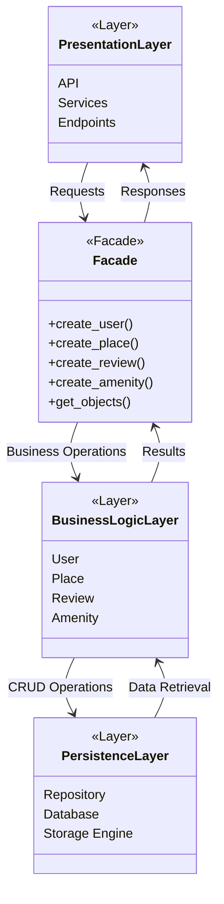
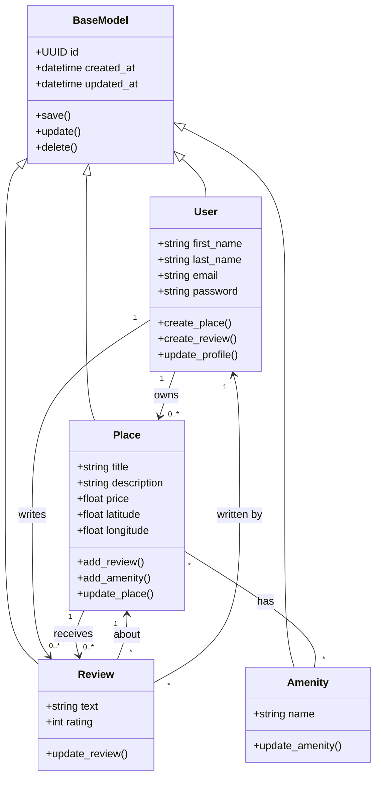
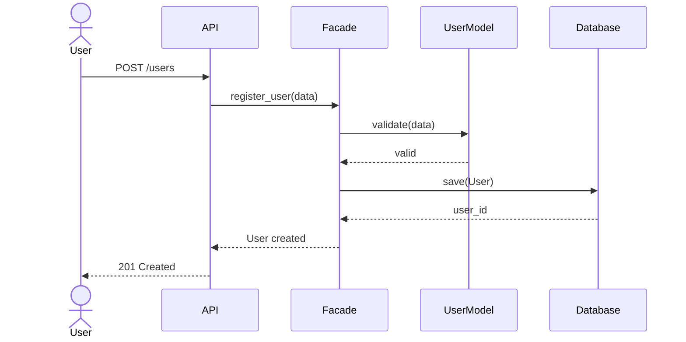
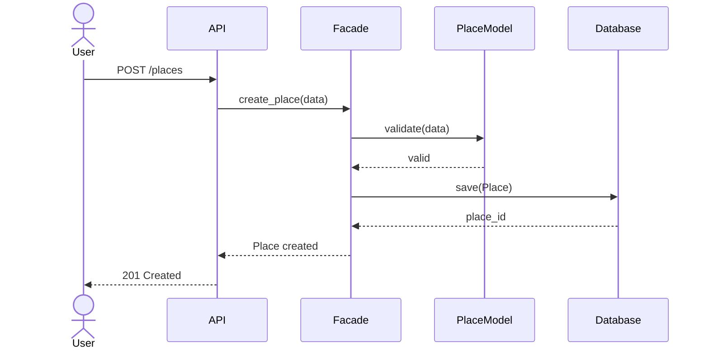
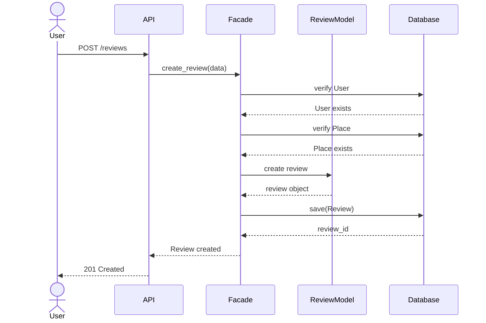
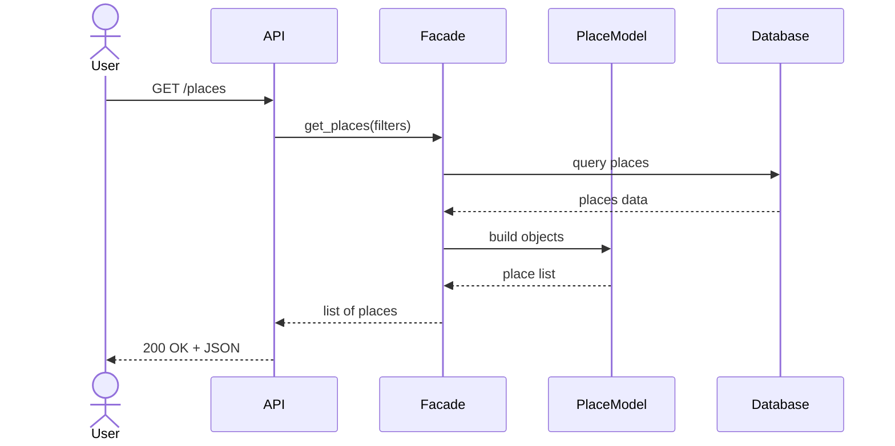

# HBnB Technical Documentation

## Introduction

This document provides the architectural and design blueprint for the HBnB application. It serves as a reference for the implementation phase by describing the system architecture, core business entities, and the interactions between different layers of the application.

The HBnB application follows a layered architecture composed of:

1. Presentation Layer
2. Business Logic Layer
3. Persistence Layer

Communication between layers is simplified through the use of the Facade design pattern.

---

# 1. High-Level Architecture

## High-Level Package Diagram

## Architecture Overview

### Presentation Layer

Responsible for:

* API endpoints
* Request processing
* Response generation

### Business Logic Layer

Responsible for:

* Business rules
* Validation
* Domain models

Main entities:

* User
* Place
* Review
* Amenity

### Persistence Layer

Responsible for:

* Data storage
* Data retrieval
* Database communication

### Facade Pattern

The Facade acts as a unified interface between the Presentation Layer and the Business Logic Layer.

Benefits:

* Reduces coupling
* Simplifies communication
* Hides implementation details
* Provides a single entry point for operations

---

# 2. Business Logic Layer

## Detailed Class Diagram

## Entity Descriptions

### BaseModel

Parent class for all entities.

Attributes:

* id (UUID4)
* created_at
* updated_at

Methods:

* save()
* update()
* delete()

### User

Represents a registered user.

Attributes:

* first_name
* last_name
* email
* password

Responsibilities:

* Create places
* Submit reviews
* Manage profile

### Place

Represents a property listing.

Attributes:

* title
* description
* price
* latitude
* longitude

Responsibilities:

* Store accommodation information
* Manage reviews
* Manage amenities

### Review

Represents feedback left by users.

Attributes:

* text
* rating

Responsibilities:

* Evaluate places
* Connect users and places

### Amenity

Represents a facility or service.

Attributes:

* name

Examples:

* Wi-Fi
* Parking
* Pool
* Air Conditioning

## Relationships

### User → Place

One user can own multiple places.

### User → Review

One user can write multiple reviews.

### Place → Review

One place can receive multiple reviews.

### Place ↔ Amenity

Many-to-many relationship:

* One place may have many amenities.
* One amenity may belong to many places.

---

# 3. API Interaction Flow

## 3.1 User Registration

### Description

A new user creates an account.

---

## 3.2 Place Creation

### Description

An authenticated user creates a new place listing.

---

## 3.3 Review Submission

### Description

A user submits a review for an existing place.

---

## 3.4 Fetching Places

### Description

A user requests a list of places.

---

# Conclusion

The HBnB application uses a layered architecture that separates responsibilities between presentation, business logic, and persistence components. The Facade pattern simplifies communication between layers and provides a clean, maintainable design.

The class diagrams define the core entities and relationships, while the sequence diagrams illustrate the execution flow of the application's main API operations. Together, these diagrams provide a complete blueprint for implementing the HBnB system.
