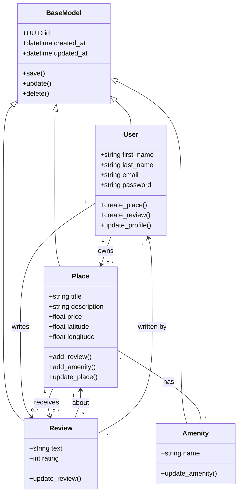

# Detailed Class Diagram for Business Logic Layer

## Mermaid Class Diagram



## Entity Descriptions

### BaseModel

The BaseModel class serves as the parent class for all business entities.

Attributes:

* id: Unique UUID4 identifier
* created_at: Creation timestamp
* updated_at: Last modification timestamp

Methods:

* save()
* update()
* delete()

---

### User

Represents a registered user of the HBnB platform.

Attributes:

* first_name
* last_name
* email
* password

Methods:

* create_place()
* create_review()
* update_profile()

Responsibilities:

* Manage account information
* Own places
* Write reviews

---

### Place

Represents a property listed on the platform.

Attributes:

* title
* description
* price
* latitude
* longitude

Methods:

* add_review()
* add_amenity()
* update_place()

Responsibilities:

* Store accommodation information
* Maintain reviews
* Maintain amenities

---

### Review

Represents feedback written by a user about a place.

Attributes:

* text
* rating

Methods:

* update_review()

Responsibilities:

* Store user feedback
* Associate users with places

---

### Amenity

Represents a service or feature available at a place.

Attributes:

* name

Methods:

* update_amenity()

Responsibilities:

* Describe facilities available at places

## Relationships

### Inheritance

All business entities inherit from BaseModel:

* User → BaseModel
* Place → BaseModel
* Review → BaseModel
* Amenity → BaseModel

This guarantees that every entity has:

* UUID identifier
* creation date
* update date

---

### User–Place Association

Multiplicity:

```text
1 User ---- 0..* Places
```

A user may own multiple places, while each place belongs to one user.

---

### User–Review Association

Multiplicity:

```text
1 User ---- 0..* Reviews
```

A user can create many reviews.

---

### Place–Review Association

Multiplicity:

```text
1 Place ---- 0..* Reviews
```

A place can receive multiple reviews.

---

### Place–Amenity Association

Multiplicity:

```text
* Place ---- * Amenity
```

Many-to-many relationship:

* One place can have many amenities.
* One amenity can belong to many places.

---

### Review Dependencies

Each review is associated with:

* exactly one user
* exactly one place

This ensures accountability and traceability of feedback within the system.

```
```
