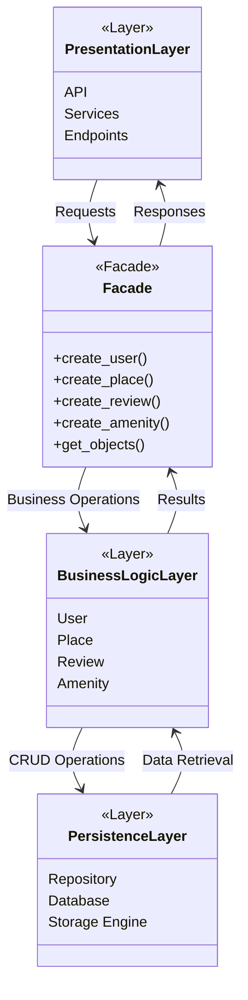

# High-Level Package Diagram – HBnB Application

## Mermaid Diagram



## Layer Responsibilities

### 1. Presentation Layer

The Presentation Layer is responsible for handling user interactions with the application. It exposes API endpoints and services that receive requests from clients and return responses.

Components:

* API Endpoints
* Services
* Request/Response Handling

### 2. Business Logic Layer

The Business Logic Layer contains the core application rules and domain models. It processes requests received from the Presentation Layer and applies business rules before interacting with the Persistence Layer.

Components:

* User
* Place
* Review
* Amenity

Responsibilities:

* Data validation
* Business rules enforcement
* Object management
* Coordination between models

### 3. Persistence Layer

The Persistence Layer manages data storage and retrieval operations.

Components:

* Repository classes
* Database access logic
* Storage mechanisms

Responsibilities:

* Create, Read, Update, Delete (CRUD) operations
* Database communication
* Data persistence

## Facade Pattern

The Facade Pattern acts as a unified interface between the Presentation Layer and the Business Logic Layer.

Benefits:

* Simplifies communication between layers
* Reduces coupling between components
* Hides implementation details
* Provides a single entry point for application operations

### Communication Flow

1. Client sends a request to the Presentation Layer.
2. The Presentation Layer forwards the request to the Facade.
3. The Facade invokes the appropriate business logic.
4. Business models perform required operations.
5. Data is stored or retrieved through the Persistence Layer.
6. Results are returned through the Facade.
7. The Presentation Layer sends the response back to the client.

```
```
