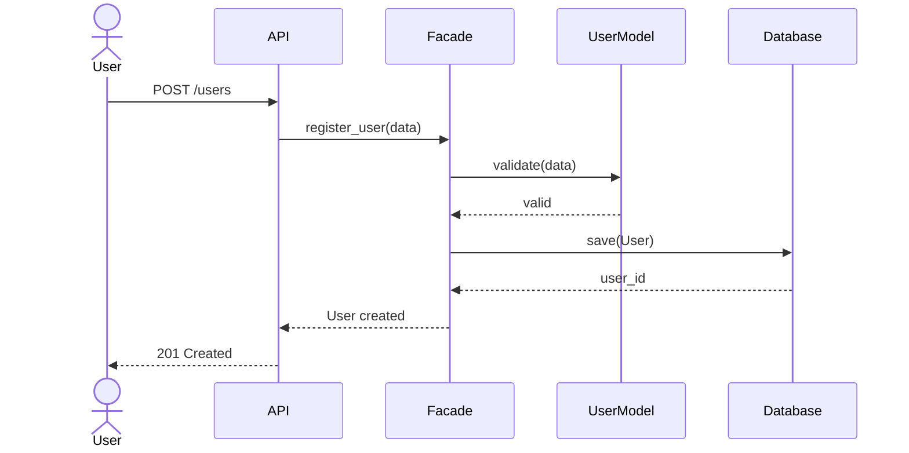
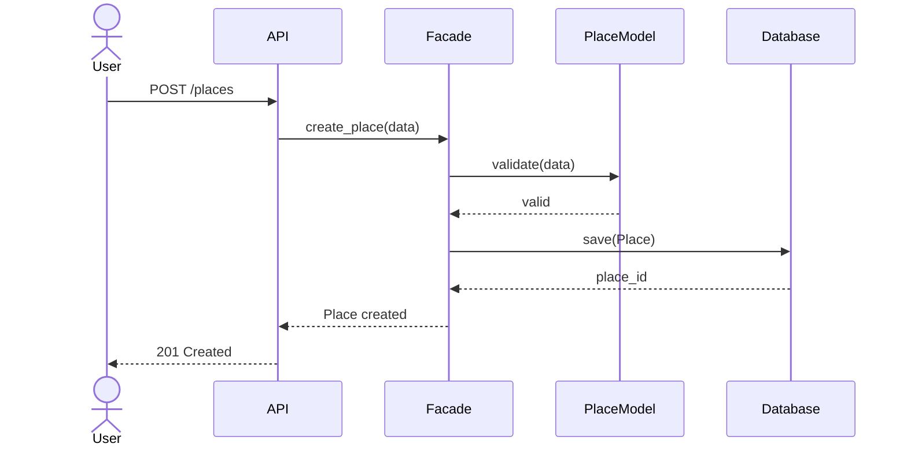
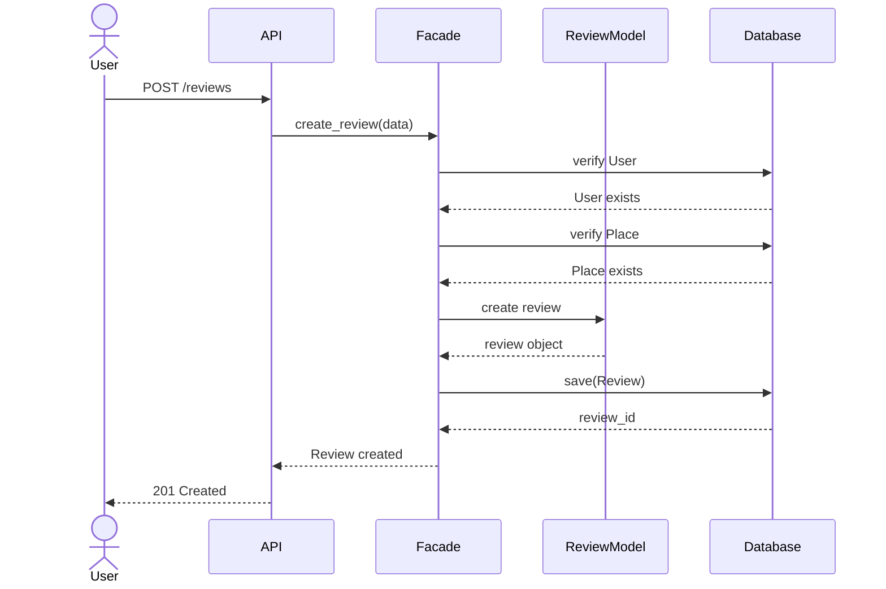
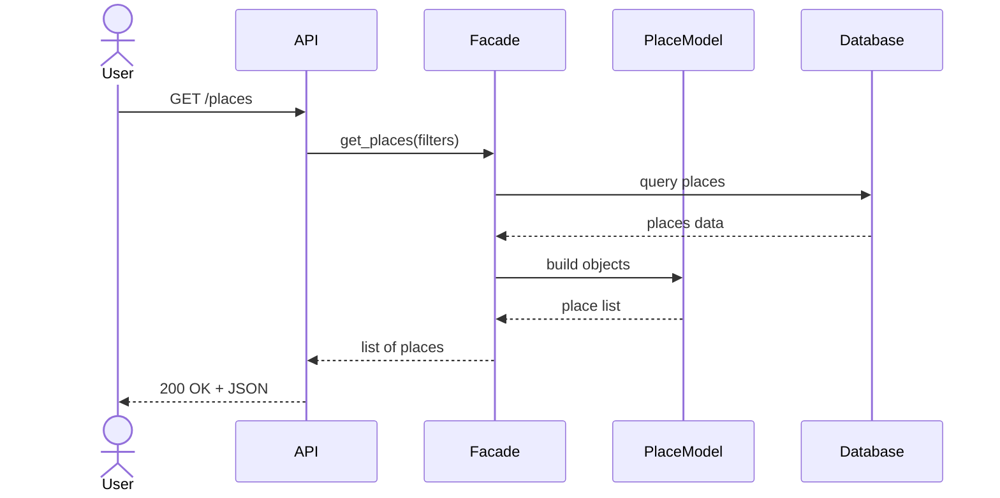

# Sequence Diagrams for API Calls

## 1. User Registration

### Description

A new user registers an account. The system validates the data, creates a User object, stores it in the database, and returns a success response.



---

## 2. Place Creation

### Description

An authenticated user creates a new place listing. The application validates ownership and stores the place in the database.



---

## 3. Review Submission

### Description

A user submits a review for an existing place. The system verifies the user and place before saving the review.



---

## 4. Fetching a List of Places

### Description

A user requests a list of places. The system retrieves matching places from the database and returns them.



---

# Layer Interaction Summary

## Presentation Layer

Responsible for:

* Receiving HTTP requests
* Validating request format
* Returning HTTP responses

Components:

* API Endpoints
* Services

## Business Logic Layer

Responsible for:

* Applying business rules
* Validating entities
* Managing Users, Places, Reviews, and Amenities

Components:

* User Model
* Place Model
* Review Model
* Amenity Model
* Facade

## Persistence Layer

Responsible for:

* Storing data
* Retrieving data
* Updating and deleting records

Components:

* Repository Layer
* Database

## Role of the Facade Pattern

The Facade acts as the single entry point to the Business Logic Layer.

Benefits:

* Simplifies communication between layers
* Reduces coupling
* Hides implementation details
* Centralizes business operations

All API requests pass through the Facade before reaching the business models and persistence layer.

```
```
